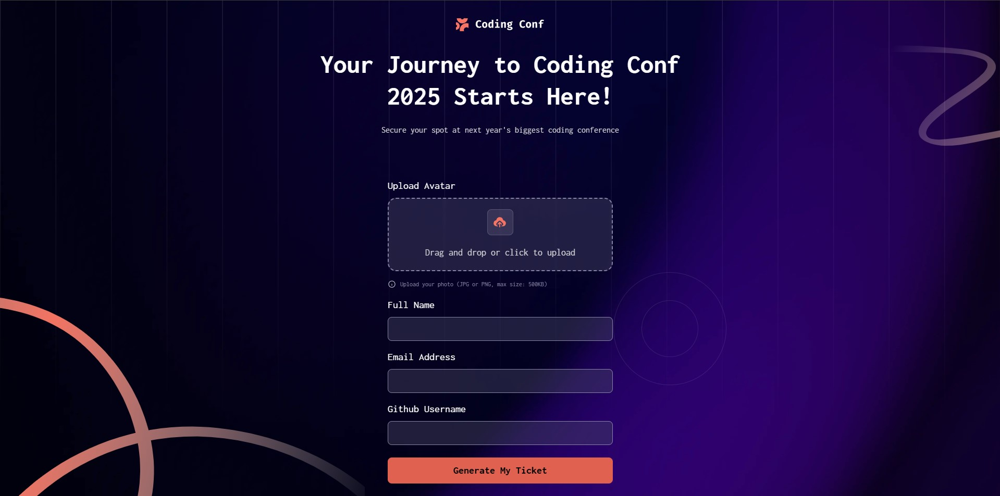
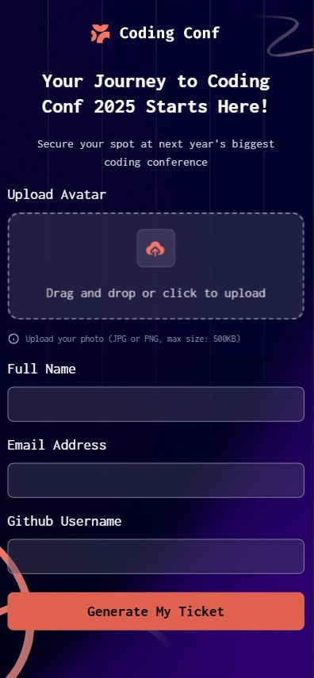
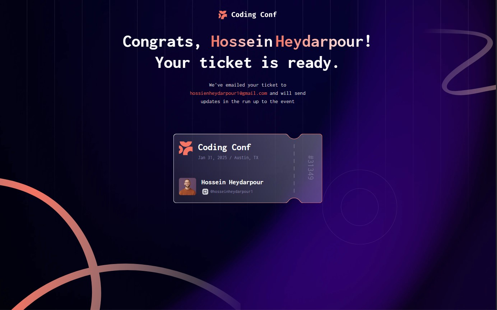
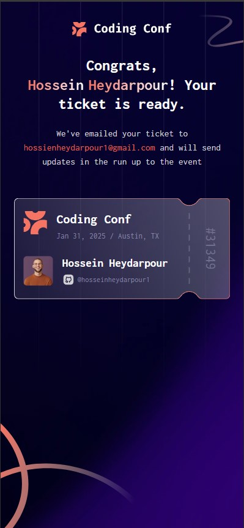

# Frontend Mentor - Conference ticket generator solution

This is a solution to the [Conference ticket generator challenge on Frontend Mentor](https://www.frontendmentor.io/challenges/conference-ticket-generator-oq5gFIU12w). Frontend Mentor challenges help you improve your coding skills by building realistic projects.

## Table of contents

- [Overview](#overview)
  - [The challenge](#the-challenge)
  - [Screenshot](#screenshot)
  - [Links](#links)
- [My process](#my-process)
  - [Built with](#built-with)
  - [What I learned](#what-i-learned)
  - [Continued development](#continued-development)
  - [Useful resources](#useful-resources)
- [Author](#author)
- [Acknowledgments](#acknowledgments)

## Overview

I took on this challenge as an opportunity to sharpen my Angular skills. While using a full-fledged framework like Angular might seem like overkill for a small project, I believe it's a valuable way to practice and reinforce key concepts. In this project, I specifically focused on implementing Angular Reactive Forms to handle form logic more efficiently and cleanly.

### The challenge

Users should be able to:

- Complete the form with their details
- Receive form validation messages if:
  - Any field is missed
  - The email address is not formatted correctly
  - The avatar upload is too big or the wrong image format
- Complete the form only using their keyboard
- Have inputs, form field hints, and error messages announced on their screen reader
- See the generated conference ticket when they successfully submit the form
- View the optimal layout for the interface depending on their device's screen size
- See hover and focus states for all interactive elements on the page

### Screenshot

### Links

- Solution URL: [Solution](https://github.com/HosseinHeydarpour/Conference-ticket-generator)
- Live Site URL: [Live(Vercel)](https://conference-ticket-generator-tawny.vercel.app/)

### Built with

- Semantic HTML5 markup
- Bootstrap 5
- Flexbox
- Mobile-first workflow
- [Angular](https://angular.dev/) - JS Framework

### What I learned

The core challenge in this project was implementing a drag-and-drop file upload (dropzone) with file size validation. Another key aspect was managing the flow of data between steps—specifically, passing the uploaded file data to the second step, which displays the generated ticket. I handled this by leveraging an Angular service to maintain and share the state across components.

### Continued development

Looking ahead, I plan to replace Bootstrap with Tailwind CSS for greater flexibility and modern styling. I'm also aiming to incorporate testing into my workflow and start practicing Test-Driven Development (TDD) to write more reliable and maintainable code.

## Author

- My Linkedin - [Hossein Heydarpour - Linkedin](https://www.linkedin.com/in/hosseinheydarpour)
- Frontend Mentor - [@HosseinHeydarpour](https://www.frontendmentor.io/profile/HosseinHeydarpour)
- My X - [@Htechdaily](https://www.x.com/Htechdaily)
